# Track 1: Logistics Picking

## Overview

This task focuses on whole-body control and end-effector coordination utilizing the **Unitree G1** humanoid robot. The objective is to bridge the gap between research and practical application by simulating a logistics scenario in which items of varying difficulty must be transferred from shelves of different heights to a transport vehicle. The system relies solely on the robot's onboard perception to execute complex maneuvers including upright, bent, and crouched postures.

Like every other track, this task supports **all three autonomy levels** — on-site teleoperation, remote teleoperation, and fully autonomous — scored with the common [autonomy multiplier](../README.md#autonomy-level-multiplier). Teleoperation may be performed with any controller of the team's choice (e.g., VR headset, inertial motion capture suit); fully autonomous runs use a learned or programmed policy end-to-end with no human control.

## Task Rules

The competition time budget is **20 minutes**, split into **two 10-minute runs**. The goal is to complete as many item transfers as possible across the two runs.

**Runs:**
- A **run** is a single **10-minute** block during which the team transfers items from the shelves to the unloading area (transport vehicle or table).
- Each team gets **exactly 2 runs** (2 × 10 minutes = 20 minutes total).
- Teams declare **one autonomy level per run** — on-site teleop, remote teleop, or fully autonomous — **before the run starts**. That single level applies to every item transferred during the run; teams cannot switch modes mid-run. The two runs may use different autonomy levels (e.g., one teleop run and one autonomous run).

**Operational Constraints (Setup & Reset):**
- **Control Method:** For teleoperation runs (on-site or remote), any controller of the team's choice is allowed (e.g., VR headset, inertial motion capture suit). For fully autonomous runs, no human control is permitted during execution.
- **Perception:** Participants must acquire external information **solely** through the robot's onboard perception system.
- **Capacity:** Within a run, there is no limit on the number of items the team attempts to transfer, provided they are not dropped.

### Step 1: Shelf Picking 

<table>
<tr><td width="280" valign="top">
     
    
    </td>

<td valign="top">

Navigate the robot to the shelving unit and extract items. The difficulty varies by shelf height, requiring specific body postures (Upright, Bent, or Crouched).

| Action | Description | Posture |
|--------|-------------|---------|
| 1a | Pick item from Top Shelf | Upright Position |
| 1b | Pick item from Middle Shelf | Bent Position |
| 1c | Pick item from Bottom Shelf | Crouched Position |

**Success Criteria:** Item securely grasped from the shelf without knocking over other items.

</td></tr>
</table>

### Step 2: Transportation

<table>
<tr><td width="280" valign="top">
    
    
    </td>

<td valign="top">

Transport the grasped items from the shelving area to the designated unloading area.

| Action | Description |
|--------|-------------|
| 2a | Stabilize item(s) during locomotion |
| 2b | Navigate to the transport vehicle/table |

**Success Criteria:** Maintain grasp on items throughout the movement. **Drops result in penalties.**

</td></tr>
</table>

### Step 3: Placement 

<table>
<tr><td width="280" valign="top">
    
    
</td>

<td valign="top">

Place the items onto the transport vehicle or unloading table.

| Action | Description |
|--------|-------------|
| 3a | Position item over target area |
| 3b | Release item securely |

**Success Criteria:** Item rests stably on the unloading surface.

</td></tr>
</table>

## Bill of Materials

| Image | Item | Qty | Price (USD) | Supplier link |
|---|---|---:|---:|---|
| 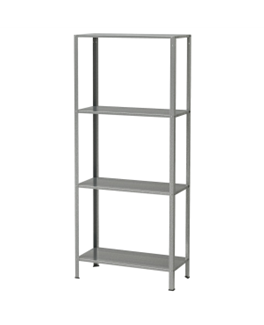 | shelf | 1 | 29.99 | [IKEA](https://www.ikea.com/us/en/p/hyllis-shelf-unit-indoor-outdoor-00278578/) |
| 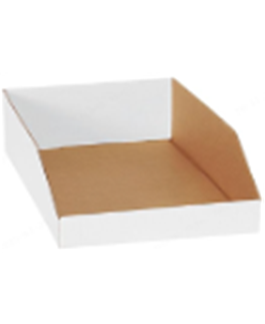 | order box (50 psc as bundle set not available in cn) | 9 | 69.56 | [Amazon](95APF9VHH5YW1VB3KP8Y&pd_rd_wg=QvimR&pd_rd_r=4ac978a7-d6eb-4451-89a6-6829ad4666b4&s=hi&sp_csd=d2lkZ2V0TmFtZT1zcF9kZXRhaWwy) |
| 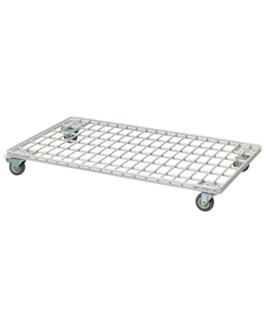 | Utility cart | 1 | 29.99 | [IKEA](http://ikea.com/us/en/p/invallning-utility-cart-for-boxes-white-10569398/) |
| 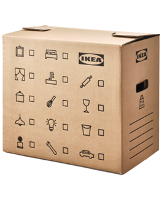 | Moving box (available in eu and cn, except us) | 1 | 2.73 | [IKEA](https://www.ikea.com/es/en/p/dundergubbe-moving-box-brown-40534562/) |
| 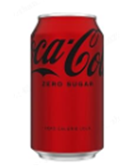 | Coke | 1 | / | [Amazon](https://www.amazon.com/Coca-Cola-Coke-Zero-Sugar-Drink/dp/B0050MLWXW/ref=sr_1_9?crid=17X5B7X7NGETD&dib=eyJ2IjoiMSJ9.mJM_VvLufX6hlQHfmKjQ4aBQ7QwgTlxcEoocaQrW6wS-LR499rEqWT90QI57qjHusUWzgaTUysArN7buAPG9MR-Suzm5cSZYUNu-L-DteSguBUmxj3Mx87cPkRGRDVbrGQlSnKmmirjz_5YNT1lHAo08QI-hibk0zglgfi3Tedzubltsip68lEkkGs4HfyqBoWDpuRIbzAxRltQVDzfYxilgZQZHinE88gaR7_iDcUM-KCWAaLNcY3G4oLbOIz8v1yeNAn3qPo5kO1NCpdWcG4Gha1oiWiK6lhMIGGy3wjM._mhXNJBe3-7lROWbHqzpGrjJkstYg6f_jBV_Pzi8oWM&dib_tag=se&keywords=coke%2Bmini&qid=1746669691&sprefix=coke%2B%2Caps%2C394&sr=8-9&th=1) |
|  | Poker Card Pack (regular poker card size) | 1 | / | [Amazon](https://www.amazon.com/dp/B0DZ2J57MC/ref=sspa_dk_detail_2?pd_rd_i=B0DZ2J57MC&pd_rd_w=BCNsU&content-id=amzn1.sym.953c7d66-4120-4d22-a777-f19dbfa69309&pf_rd_p=953c7d66-4120-4d22-a777-f19dbfa69309&pf_rd_r=YNAJJXZ9F3EF0JFK4RH7&pd_rd_wg=r9uOa&pd_rd_r=203adc45-ac91-40a9-aa75-ccdd1b8e10fc&s=toys-and-games&sp_csd=d2lkZ2V0TmFtZT1zcF9kZXRhaWwy&th=1) |
| 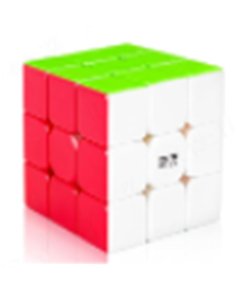 | Speed Cube | 1 | / | [Amazon](https://www.amazon.com/dp/B0CWLBS566/ref=sspa_dk_detail_5?pd_rd_i=B09W2PPXQL&pd_rd_w=SjC9m&content-id=amzn1.sym.7446a9d1-25fe-4460-b135-a60336bad2c9&pf_rd_p=7446a9d1-25fe-4460-b135-a60336bad2c9&pf_rd_r=1HH994BQBN8YVVS2MH3Y&pd_rd_wg=siJpN&pd_rd_r=3875d162-b7bf-4c49-9a77-33ed077999f5&s=toys-and-games&sp_csd=d2lkZ2V0TmFtZT1zcF9kZXRhaWw&th=1) |
|  | Tennis Ball | 1 | / | [Amazon](https://www.amazon.com/SHYUJAJIE-Training-Elasticity-Practice-Beginner/dp/B0CF8FB3PR/ref=sxin_16_pa_sp_search_thematic_sspa?content-id=amzn1.sym.c5787da2-212d-48eb-a894-9ea5a87adeb3%3Aamzn1.sym.c5787da2-212d-48eb-a894-9ea5a87adeb3&crid=1SYH9P9RQBTW&cv_ct_cx=tennise%2Bball&keywords=tennise%2Bball&pd_rd_i=B0CF8FB3PR&pd_rd_r=f74b69a5-23d5-40a5-8e38-12b6249edb47&pd_rd_w=TO9rY&pd_rd_wg=uOI3Q&pf_rd_p=c5787da2-212d-48eb-a894-9ea5a87adeb3&pf_rd_r=S45PQD973E33ZG73QB7F&qid=1737625790&sbo=RZvfv%2F%2FHxDF%2BO5021pAnSA%3D%3D&sprefix=tennise%2Bball%2Caps%2C375&sr=1-2-6024b2a3-78e4-4fed-8fed-e1613be3bcce-spons&sp_csd=d2lkZ2V0TmFtZT1zcF9zZWFyY2hfdGhlbWF0aWM&th=1) |
| 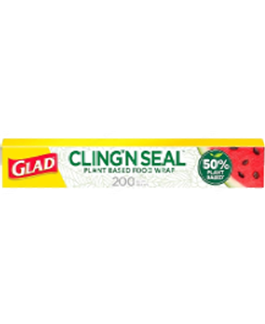 | Cling Wrap | 1 | / | [Amazon](https://www.amazon.com/Glad-Plant-Based-Cling-Seal-Square/dp/B0BMWBVZVB/ref=sr_1_5_sspa?dib=eyJ2IjoiMSJ9.8ESWl9lQN6bRyOyzAh_orA.Zl71E_SlhlmT5iZ1Fkk0bpRexS9hk3atxQinjmXF95o&dib_tag=se&keywords=cling%2Bwrap%2B15inch&qid=1745239812&s=hpc&sr=1-5-spons&sp_csd=d2lkZ2V0TmFtZT1zcF9tdGY&th=1) |
| 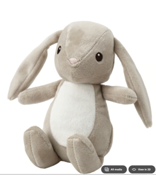 | Soft toy | 1 | 3 | [IKEA](https://www.ikea.com/gb/en/p/dvaerghare-soft-toy-bunny-beige-20597065/) |
| 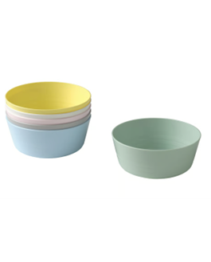 | Bowl, mixed colours | 1 | 1.99 | [IKEA](https://www.ikea.com/us/en/p/kalas-bowl-mixed-colors-20461378/?recently_viewed_v2=b) |
| 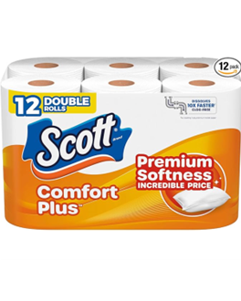 | Toilet Paper | 1 | / | [Amazon](https://www.amazon.com/Scott-Comfortplus-Toilet-Tissue-Double/dp/B07BGLT25K/ref=sr_1_2?crid=KWREQMC5O9OQ&dib=eyJ2IjoiMSJ9.zsorHJkFxY0OC-dfSrFb-gHo4Tl8iZEAC-RKDpWMz60g-fTuMFbijm1zfELy21JHV44aisxvwd-39zMKfQ3bZLeIvxgB5AA7SA44w0-ju5h7pt32JfQQljcFO-nx_OSMYfstVqZNLAYUV5oa7x3wgXTjNqBeISTkfPgNQLyIudjj00ZCn68mLSw-pwKSQtXpCYBoOf-pUzG5voQ0Px3k5B53PgINdlLqoZYKM80AR48jfxfwxgYHhN3Bmh6EpBlBn3udwgcuNugHsRwjQcHExYfIiUl_wzw4azEIAgW3wxc.bbCg4IPMc0AuzvE1akRs2i41TFoTW6W8yTfORnSTMtg&dib_tag=se&keywords=toilet%2Bpaper&qid=1770904865&sprefix=toilet%2Caps%2C359&sr=8-2&th=1) |
|  | Bar soap | 1 | / | [Amazon](https://www.amazon.com/Antibacterial-Bath-Soap-Pack-bars/dp/B001AQXH1C/ref=sr_1_3?crid=1KP7VGGYHV3KL&dib=eyJ2IjoiMSJ9.PHzy9QWOpiKb5MfDmFAqw1lDOZ4DDg__08q0Vb8cx532ThEfe4Yh5K158B-ZIB0nzfabFwmkzJTRj_7V08zoaw07gEuMaIiF5V2v12wciUXw02hRvfZPzfJ4fDYKMeZNnw9GZZL6YOC5Z_kq-yHciIsAU8Wspnm0AS5nJwlmM0L4InR5fRhBtICJwOUJSd5OQU0VIiIoPab4lIcCC5HZU3ooM4olVO8k_geS7oYIAzinH3hoLx1MSk7imqNUvsBXwABU1GUXVSVonNISBkuJR7chBe4uYrBnrRfoJ_RXiPk.DxHY8vaXDsoPCi8XofGLZf3ksChHdX5t0UY6Cj1ywEc&dib_tag=se&keywords=safegard%2Bbar%2Bsoap&qid=1770904831&sprefix=safegar%2Caps%2C380&sr=8-3&th=1) |
| 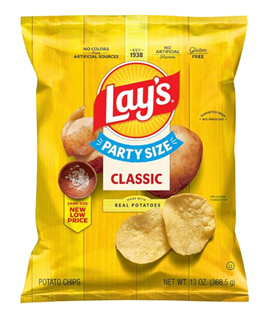 | Potato chips | 1 | / | [Amazon](https://www.amazon.com/Lays-Classic-Potato-Chips-Ounce/dp/B072M1NC4M?ref_=ast_sto_dp&th=1) |

<!-- ### 3D-Printed Parts

Printable STL and source CAD files are in [`parts/`](parts/). -->

<!-- TODO: List printed parts if any -->

## Scoring

### Competition Rules

- **Time limit:** 20 minutes per team, split into **two 10-minute runs**.
- **Objective:** Maximize total score by transferring items of varying difficulty across the two runs.
- **Definition of Success:** A transfer is complete when an item is taken from a shelf and placed on the unloading area table within that run's 10-minute window.
- **Perception:** Only robot-onboard sensors allowed (no external global cameras for the operator).
- **Autonomy multiplier:** Teams declare **one autonomy level per run** (×1 on-site teleop / ×2 remote teleop / ×4 fully autonomous) before the run starts. Base points from all successful transfers in that 10-minute run are summed, then multiplied by that run's [autonomy level multiplier](../README.md#autonomy-level-multiplier). The same level applies to every item in the run — teams do not switch modes mid-run or per item. The two runs may use different autonomy levels.

### Point Breakdown

Scoring is weighted based on the difficulty of the whole-body motion required (posture).

#### Item Transfer Scoring

| Source | Posture | Points | Criteria |
|--------|:-------:|:------:|----------|
| **Top Shelf** | Upright | **+5** | Successful transfer from high shelf |
| **Middle Shelf** | Bent | **+8** | Successful transfer from low/middle shelf |
| **Bottom Shelf** | Crouched | **+10** | Successful transfer from ground/bottom shelf |
| **Item Drop** | — | **-3** | Per item dropped during transportation (between shelf and table) |

### Example

> A team's two 10-minute runs, each with its own declared autonomy level:
>
> **Run 1 — Remote teleop (×2)**
>
> | Item Type | Qty | Points | Subtotal |
> |:---------:|:---:|:------:|:--------:|
> | Top Shelf | 4 | 5 | 20 |
> | Middle Shelf | 2 | 8 | 16 |
> | Bottom Shelf | 1 | 10 | 10 |
> | **Drops** | 2 | -3 | -6 |
> | | | **Base total** | **40** |
>
> Run 1 score: **40 × 2 = 80**.
>
> **Run 2 — Fully autonomous (×4)**
>
> | Item Type | Qty | Points | Subtotal |
> |:---------:|:---:|:------:|:--------:|
> | Top Shelf | 2 | 5 | 10 |
> | Middle Shelf | 1 | 8 | 8 |
> | Bottom Shelf | 0 | 10 | 0 |
> | **Drops** | 1 | -3 | -3 |
> | | | **Base total** | **15** |
>
> Run 2 score: **15 × 4 = 60**.
>
> **Total:** 80 + 60 = **140**.

## Coming Soon

- **Datasets** — UMI and/or real robot teleoperation datasets for this task
- **Simulation Environment** — digital-twin simulator for this task
