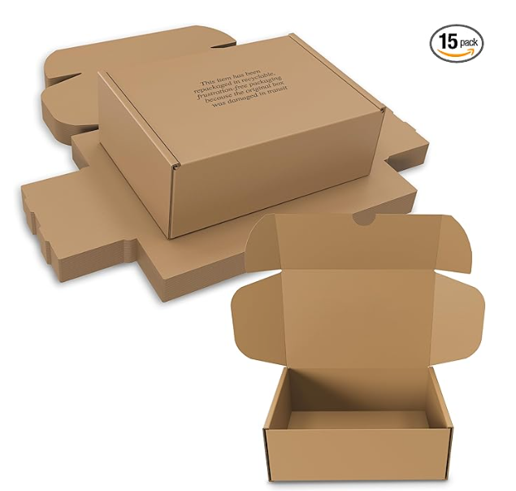
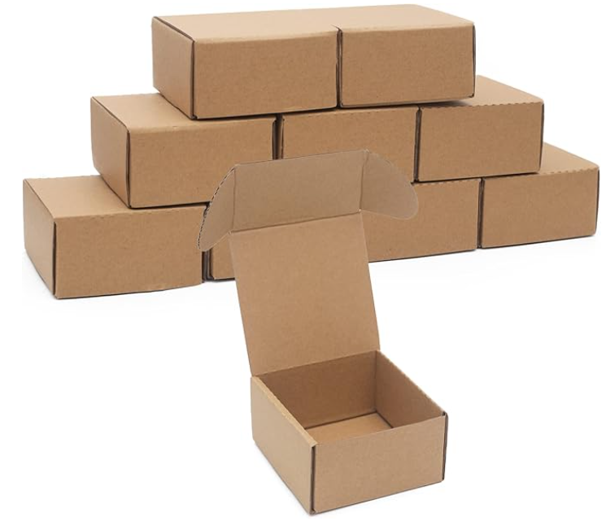
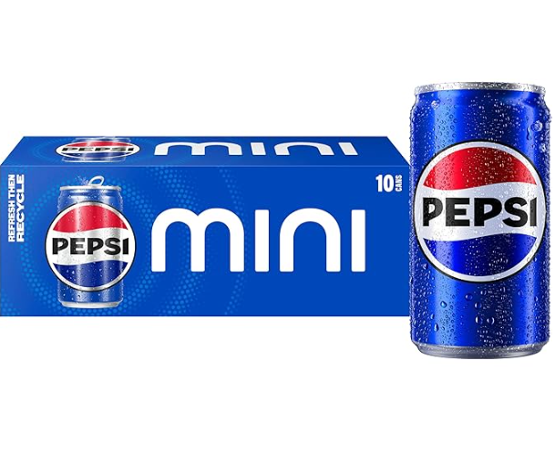
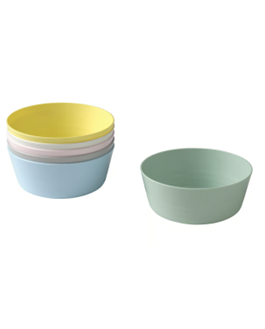
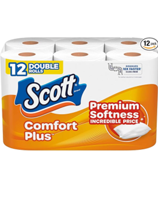
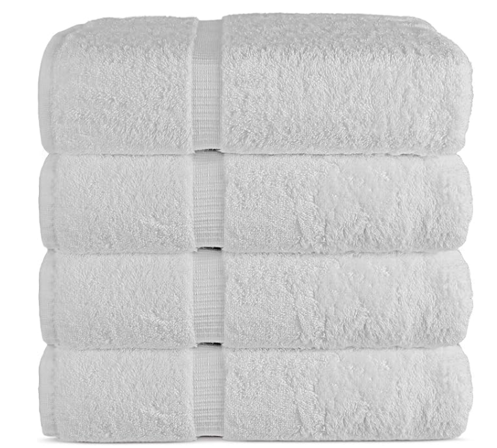
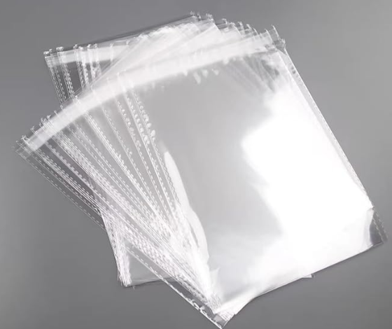

# Track 2: Logistics Packing

## Overview

The objective of this challenge is to demonstrate robotic capabilities in logistics fulfillment. The system must pick, scan, and pack items from a primary storage container into three designated shipping parcels. The workflow involves handling diverse items (rigid boxes, irregular shapes, and soft apparel), identifying barcodes via wrist-mounted cameras, and securing the parcels by closing their lids.

## Task Rules

The competition window is **30 minutes**. Teams must fulfill as many shipping parcels as possible within this time. The workflow consists of three main sequential steps per item/parcel.

**Operational Constraints (Setup & Reset):**
- Participants may configure the placement of storage containers, shipping parcels, and the table.
- Time required for scene resets is **excluded** from the 30-minute competition window.
- **Human Intervention:** If a human intervenes during a cycle, the task for that specific item is terminated immediately, and a partial score is recorded.

### Step 1: Picking & Scanning

<table>
<tr><td width="280" valign="top">

</td><td valign="top">

Grasp an item from the storage container and identify it. The container is pre-loaded with various items (boxes, irregular objects, soft bags).

| Action | Description |
|--------|-------------|
| 1a | Grasp and extract an item from the storage container |
| 1b | Scan the barcode using a wrist-mounted camera |
| 1c | Receive index corresponding to one of the 3 shipping parcels |

**Success Criteria:** Item securely grasped, barcode successfully identified, target parcel determined.

</td></tr>
</table>

### Step 2: Placing

<table>
<tr><td width="280" valign="top">

</td><td valign="top">

Transition the picked item to the designated shipping parcel.

| Action | Description |
|--------|-------------|
| 2a | Move the item to the assigned shipping parcel |
| 2b | Place the item securely inside the parcel |

**Success Criteria:** Item placed in the correct parcel (1 of 3) without dropping.

</td></tr>
</table>

### Step 3: Packing (Lid Closing)

<table>
<tr><td width="280" valign="top">

</td><td valign="top">

Once a parcel is full or the sequence is complete, operate the parcel lid mechanism to secure the package.

| Action | Description |
|--------|-------------|
| 3a | Fold the box lid flat |
| 3b | Tuck in the two-sided lips |
| 3c | Engage the locking lid mechanism |

**Success Criteria:** Lid is closed flat, lips are tucked, and the box is locked.

</td></tr>
</table>

## Bill of Materials

| | Item | Qty | Unit Price (USD) | Supplier |
|:---:|------|:---:|---:|------|
|  | Storage container (18"L x 12"W x 4.5"H) | 1 | $1.58 | [Amazon](https://www.amazon.com/dp/B07G44918B/ref=sspa_dk_detail_5?psc=1&pd_rd_i=B07G44918B&pd_rd_w=JdVPo&content-id=amzn1.sym.953c7d66-4120-4d22-a777-f19dbfa69309&pf_rd_p=953c7d66-4120-4d22-a777-f19dbfa69309&pf_rd_r=95APF9VHH5YW1VB3KP8Y&pd_rd_wg=QvimR&pd_rd_r=4ac978a7-d6eb-4451-89a6-6829ad4666b4&s=hi&sp_csd=d2lkZ2V0TmFtZT1zcF9kZXRhaWwy) |
|  | Shipping parcels (9.5"L x 5.13"W x 14.63"H) | 1 | $4.67 | [Amazon](https://www.amazon.com/Large-STRONG-Shipping-replacement-BOXES/dp/B0DWK8PYPZ/ref=sr_1_27?dib=eyJ2IjoiMSJ9.I6FD5PtSnvZQMOGkd6mdDnU0hq9YFr-28B0Jle0oBHqB8-MYpaLC-_6xU0wnHdH-ial990coPq1TVmxUwRqHQIlMaIazQt9NTNk9L16mzSrTbezICs2mEnZBDQWQWmS9kkCpT6VGMwzB2-AA64A2OavoA0_ROXIdmLaVmOYcpzyFLfVBDYte02j666MafsKHzfgaHK6Y76fQg87Oj_sKf_zsADi6vNNssfxMLkvTkPyJjW1EeUViDywd9SMKh2GRRJ8Cb8ZRrCyJ_BlHDDXyKcqfk88rIngulblw2AgYy3E.2mK42-9IpIKgYINNdtXhQd5q-Kqm2Brif2Z3PVNrxo8&dib_tag=se&keywords=shipping%2Bbox&qid=1745919102&refinements=p_n_feature_six_browse-bin%3A118803197011%2Cp_n_feature_browse-bin%3A118710204011%7C118710205011&rnid=118710164011&s=office-products&sr=1-27&th=1) |
|  | Rectangular cardboard boxes (4x4x2) | 1 | $9.98 for 10 pcs | [Amazon](https://www.amazon.com/Shipping-Corrugated-Cardboard-Recyclable-Packaging/dp/B09MMD95BM/ref=sr_1_7?crid=EVD57W9LJU7X&dib=eyJ2IjoiMSJ9.Xm9l_Bq_OChVnPzvMS1KzI8hE_kySz3GbsVy8nXfifgrUnAinFw0lP7IDb3ajv19IzvAeACI15IbROpkIpqahG7qmTfCdIbSo6zpmS0l0c51N-kcDAdOvZSdcHCkHqXWUOYN3JEHJWZllnm55kMQRR1Tp6tBsD1_RI9iVrFqrwBpkp4iSTwPIhklakKYlgK15Ve2l-Vx3D7DGcorp04MIhUl8Du7Qy-5ZrjLdMqI88sRaFdoLAN2LePllOvez2HuxiDEQNnZrjFKmPPAjgijj0-Kg3aXxD96jl7ds961zoI.Sc_VzFIkOD9_CCzE6lRFMc-H9fI0KOqDH_sQrsO1__Y&dib_tag=se&keywords=small%2Bpacking%2Bbox&qid=1771011443&sprefix=small%2Bpacking%2Bbo%2Caps%2C199&sr=8-7&th=1) |
|  | Pepsi Cola | 1 | $5.48 | [Amazon](https://www.amazon.com/Pepsi-Soda-Ounce-Mini-Cans/dp/B07BYYQD2B/ref=sr_1_3_sspa?crid=1CZUFW8COJWGO&dib=eyJ2IjoiMSJ9.Fj55ift421vM_eAt4YBOqwRMcXE7fzA81YWBkPAouOYtZeJmszj8wX8x7BSg5xB5gM48U6u2Uz2C0IabSPd4PA.ToqQRYlziNJ7Hl6cFrkalna0fXsmVCSPWNh_f3HFoLI&dib_tag=se&keywords=coke%2Bcola%2Bmini&qid=1771011772&s=toys-and-games&sprefix=coke%2Bcola%2Bm%2Ctoys-and-games%2C215&sr=1-3-spons&sp_csd=d2lkZ2V0TmFtZT1zcF9hdGY&th=1) |
|  | Poker | 1 | $42.99 for 48 pcs | [Amazon](https://www.amazon.com/dp/B0DZ2J57MC/ref=sspa_dk_detail_2?pd_rd_i=B0DZ2J57MC&pd_rd_w=BCNsU&content-id=amzn1.sym.953c7d66-4120-4d22-a777-f19dbfa69309&pf_rd_p=953c7d66-4120-4d22-a777-f19dbfa69309&pf_rd_r=YNAJJXZ9F3EF0JFK4RH7&pd_rd_wg=r9uOa&pd_rd_r=203adc45-ac91-40a9-aa75-ccdd1b8e10fc&s=toys-and-games&sp_csd=d2lkZ2V0TmFtZT1zcF9kZXRhaWwy&th=1) |
|  | Speed cube | 1 | $37.99 for 20 pcs | [Amazon](https://www.amazon.com/dp/B0CWLBS566/ref=sspa_dk_detail_5?pd_rd_i=B09W2PPXQL&pd_rd_w=SjC9m&content-id=amzn1.sym.7446a9d1-25fe-4460-b135-a60336bad2c9&pf_rd_p=7446a9d1-25fe-4460-b135-a60336bad2c9&pf_rd_r=1HH994BQBN8YVVS2MH3Y&pd_rd_wg=siJpN&pd_rd_r=3875d162-b7bf-4c49-9a77-33ed077999f5&s=toys-and-games&sp_csd=d2lkZ2V0TmFtZT1zcF9kZXRhaWw&th=1) |
|  | Tennis ball | 1 | $1.27 | [Amazon](http://amazon.com/Magicorange-Advanced-Training-Practice-Beginner/dp/B0917MKGNT/ref=sr_1_2_sspa?crid=2D1MZ74HYMLFM&dib=eyJ2IjoiMSJ9.CD4kPFcJrkCKexUKWAENegI22ZQeSUhytnJ-ymfr4ci9gz-5xvcmNhBE62bJb3Q1OgdA3hj9PJyes-vTMVnl-9aUrmdNFZrn6VdfqBMCTCZhqWEBNA6v4CfcQqHjoPbuTna_ODC2pYWlmO9uO_7XjF5qIRZ_RZH7DEBc-wug0ClDGTJaT04rN8WS9V9x3nREH1143Sq-9ptaCcilY-A0VEPDkEYLxpKC0XfVR3yRamqukNhnp0LimzkHCxdBoel_iGiDp5bYxTTE5d4nhMJ4CVGjN4D75ZslPjNeLpPEYDU.vkue3DAFrSzAd35d1ph-00BLwsULUyeNYHTgk9LSQTg&dib_tag=se&keywords=tennis+balls&qid=1771011837&s=toys-and-games&sprefix=tennis+%2Ctoys-and-games%2C211&sr=1-2-spons&sp_csd=d2lkZ2V0TmFtZT1zcF9hdGY&psc=1) |
|  | Cling wrap | 1 | $4.99 | [Amazon](https://www.amazon.com/Glad-Plant-Based-Cling-Seal-Square/dp/B0BMWBVZVB/ref=sr_1_5_sspa?dib=eyJ2IjoiMSJ9.8ESWl9lQN6bRyOyzAh_orA.Zl71E_SlhlmT5iZ1Fkk0bpRexS9hk3atxQinjmXF95o&dib_tag=se&keywords=cling%2Bwrap%2B15inch&qid=1745239812&s=hpc&sr=1-5-spons&sp_csd=d2lkZ2V0TmFtZT1zcF9tdGY&th=1) |
|  | Bowl, mixed colours | 1 | $1.99/6 pack | [IKEA](https://www.ikea.com/us/en/p/kalas-bowl-mixed-colors-20461378/?recently_viewed_v2=b) |
|  | Toilet paper | 1 | $5.68 | [Amazon](https://www.amazon.com/Scott-Comfortplus-Toilet-Tissue-Double/dp/B07BGLT25K/ref=sr_1_2?crid=KWREQMC5O9OQ&dib=eyJ2IjoiMSJ9.zsorHJkFxY0OC-dfSrFb-gHo4Tl8iZEAC-RKDpWMz60g-fTuMFbijm1zfELy21JHV44aisxvwd-39zMKfQ3bZLeIvxgB5AA7SA44w0-ju5h7pt32JfQQljcFO-nx_OSMYfstVqZNLAYUV5oa7x3wgXTjNqBeISTkfPgNQLyIudjj00ZCn68mLSw-pwKSQtXpCYBoOf-pUzG5voQ0Px3k5B53PgINdlLqoZYKM80AR48jfxfwxgYHhN3Bmh6EpBlBn3udwgcuNugHsRwjQcHExYfIiUl_wzw4azEIAgW3wxc.bbCg4IPMc0AuzvE1akRs2i41TFoTW6W8yTfORnSTMtg&dib_tag=se&keywords=toilet%2Bpaper&qid=1770904865&sprefix=toilet%2Caps%2C359&sr=8-2&th=1) |
|  | Bar soap | 1 | $8.59 | [Amazon](https://www.amazon.com/Antibacterial-Bath-Soap-Pack-bars/dp/B001AQXH1C/ref=sr_1_3?crid=1KP7VGGYHV3KL&dib=eyJ2IjoiMSJ9.PHzy9QWOpiKb5MfDmFAqw1lDOZ4DDg__08q0Vb8cx532ThEfe4Yh5K158B-ZIB0nzfabFwmkzJTRj_7V08zoaw07gEuMaIiF5V2v12wciUXw02hRvfZPzfJ4fDYKMeZNnw9GZZL6YOC5Z_kq-yHciIsAU8Wspnm0AS5nJwlmM0L4InR5fRhBtICJwOUJSd5OQU0VIiIoPab4lIcCC5HZU3ooM4olVO8k_geS7oYIAzinH3hoLx1MSk7imqNUvsBXwABU1GUXVSVonNISBkuJR7chBe4uYrBnrRfoJ_RXiPk.DxHY8vaXDsoPCi8XofGLZf3ksChHdX5t0UY6Cj1ywEc&dib_tag=se&keywords=safegard%2Bbar%2Bsoap&qid=1770904831&sprefix=safegar%2Caps%2C380&sr=8-3&th=1) |
|  | Potato chips | 1 | $0.57 | [Amazon](https://www.amazon.com/Lays-Classic-Potato-Chips-Ounce/dp/B072M1NC4M?ref_=ast_sto_dp&th=1) |
|  | towel | 1 | $39.99 | [Amazon](https://www.amazon.com/Luxury-Hotel-Genuine-Turkish-Cotton/dp/B00HTB2XOO/ref=sr_1_3_sspa?crid=1MAW5VDX805ZS&dib=eyJ2IjoiMSJ9._dVkz6R7F0j7CoZfAvDc8oeMRtGTRGs0qLL4H_ZGYmZCwBprkQqsmy317JYpfcYH_A4O06RuUxPzmyqMYnsep_Oig5CA5FLBr1jw8zbnX4Hv28L_LcHn4lBdgRQtxOEA6uZokcY4IgTtqjJJmTqzEMA9_j2ITh1ujaxwv4R1tkLrJGR96PprjPlpLf45r2AeQXshEQw3976dEClp9gvaofT2p1DVRwgBbJqSIihb6JFAd-cADEjLa4O9Obzj0yDqQsZMotNcigQDOSWvhM3SREHG2CxKo5BKEWXeJXb6iB0.KE8LPjJJ4OH7bQCjZjlATUej5ofq4pGUlJVOq_B8qHE&dib_tag=se&keywords=towels&qid=1771012139&sprefix=towe%2Caps%2C228&sr=8-3-spons&sp_csd=d2lkZ2V0TmFtZT1zcF9hdGY&psc=1) |
|  | toy | 1 | $6.99 | [IKEA](https://www.ikea.com/gb/en/p/dvaerghare-soft-toy-bunny-beige-20597065/) |
|  | plastic bag | 1 | $9.99 | [Amazon](https://www.amazon.com/Muyindo-Packaging-Clothing-T-Shirts-Cellophane/dp/B07FT96QW1/ref=sr_1_2_sspa?crid=15OWYVSZ7CZPC&dib=eyJ2IjoiMSJ9.tq4TJXMw9XGxLt5W1152MDAYxqk7LD-BPi5fnEwXMBZtr1Gp1m8kFv_a4OpzYKAZT1WHUj5udFMwMuLiVY7tT2i8tmoUgu5h-XC5mrTCwJT0JH5Q3gZtp6LcGuKQG09EJ7BoWl40tM2fnp0ky2HxJGE177hMPBOPOPQhR93UsINQBllFZhtroK6G9GI0MEFATPNBqu5npO0JYvq0rQpP23XveItsk2uSo7d49m8HCtqJq4HdU67EPbCguBc5brkpSso-E0detw59G0gdmDC8Mt5Qt51Mef0N84HRDS3N9oM.glWX1RkMgO3Aw-CUJVtpD1pswr6iOTYIFTyCYAnseG4&dib_tag=se&keywords=plastic+backing+bag&qid=1771012181&sprefix=plastic+backing+ba%2Caps%2C219&sr=8-2-spons&sp_csd=d2lkZ2V0TmFtZT1zcF9hdGY&psc=1) |

### 3D-Printed Parts

Printable STL and source CAD files are in [`parts/`](parts/).

<!-- TODO: List printed parts if any -->

## Scoring

### Competition Rules

- **Time limit:** 30 minutes per team.
- **Workflow:** Pick → Scan → Place → Pack.
- **Intervention:** Human intervention terminates the task for the specific item (partial score recorded).
- **Placement:** Teams determine the layout of the table, container, and parcels.

### Point Breakdown

Scoring is based on the successful processing of individual items and the final state of the parcel closing mechanism.

#### Item Processing

| Action | Points | Criteria |
|--------|:------:|----------|
| Pick, Scan, Place | +5 | Successfully picks, scans, and places one item |
| Wrong Parcel | -5 | Penalty applied if item is placed in incorrect parcel |

#### Parcel Finalization (Lid Closing)

Points for lid closing are cumulative based on the quality of the fold.

| Action | Points | Criteria |
|--------|:------:|----------|
| Lid Flat | +5 | Box lid is covered flat without item sticking out |
| Side Lips | +10 | The two-sided lips both stick in |
| Locking Lid | +15 | Locking mechanism securely sticks in |

### Example

> A robot processes an item correctly but places it in the wrong box, then successfully closes another box fully:
>
> | Action | Result | Score |
> |:-----:|:------:|:-----:|
> | Item A | Pick/Scan/Place (+5) but Wrong Parcel (-5) | 0 |
> | Item B | Pick/Scan/Place Correctly | +5 |
> | Parcel Closing | Locking Lid Fully Closed | +15 |
> | | **Total** | **20** |

## Coming Soon

- **Datasets** — UMI and/or real robot teleoperation datasets for this task
- **Simulation Environment** — digital-twin simulator for this task