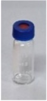
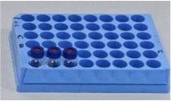
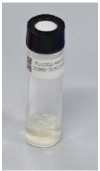
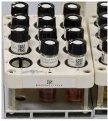
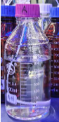

# Track 3: Lab Experiments

## Overview

This task simulates a laboratory automation workflow. The system handles high-density sample racks, interfaces with analytical instruments, and performs reagent bottle operations (threaded caps and flexible tubing). The full task consists of three sequential steps performed in rounds.

## Task Rules

The competition time limit is **20 minutes**. Teams perform **Steps 1 → 2 → 3 in order** as one round. After completing a round, the workspace is reset and the next round begins. The goal is to complete as many rounds as possible within this window.

**Operational Constraints (Setup & Reset):**
- **Mandatory sequence:** All three steps must be attempted per round — you cannot skip a step or reorder them. A new round cannot begin until the current round's Step 3 is completed or attempted.
- **Reset Time:** Time spent resetting the workspace between rounds is excluded from the 20-minute competition window.
- **Cumulative scoring:** Points earned in a partially completed round (when time expires) still count.

### Step 1: Sample Loading

<table>
<tr><td width="280" valign="top">

</td><td valign="top">

Place vials into partially filled racks (dense packing). The racks already contain vials in most positions — seat the remaining vials into the correct empty slots.

| Action | Description |
|--------|-------------|
| 1a | Seat a 2 mL vial into the 2 mL rack |
| 1b | Seat a 2 mL vial into the 2 mL rack |
| 1c | Seat an 8 mL vial into the 8 mL rack |
| 1d | Seat an 8 mL vial into the 8 mL rack |

**Success Criteria:** All 4 vials fully inserted, upright, correct positions. No damage or drops.

</td></tr>
</table>

### Step 2: Instrument Interfacing

<table>
<tr><td width="280" valign="top">

</td><td valign="top">

Load a sample rack into an analytical instrument by operating its drawer mechanism.

| Action | Description |
|--------|-------------|
| 2a | Open the instrument drawer |
| 2b | Place the rack in the correct position |
| 2c | Close the instrument drawer |

**Success Criteria:** Drawer opened/closed without excessive force. Rack in correct position.

</td></tr>
</table>

### Step 3: Mobile Phase Management

<table>
<tr><td width="280" valign="top">

</td><td valign="top">

Switch the solvent supply line from bottle A to bottle B by operating threaded caps and relocating the flexible tubing.

| Action | Description |
|--------|-------------|
| 3a | Remove the cap from the source bottle |
| 3b | Remove the tubing from the source bottle |
| 3c | Insert the tubing into the target bottle |
| 3d | Replace the cap on the source bottle |

**Success Criteria:** Caps intact, tubing relocated, bottles upright, no spills.

</td></tr>
</table>

## Bill of Materials

| | Item | Qty | Unit Price (CNY) | Supplier |
|:---:|------|:---:|---:|------|
|  | 2 mL Sample Vial | Per setup | 0.4 | [Taobao](https://item.taobao.com/item.htm?id=17615677498) |
|  | 2 mL Sample Vial Rack | 1 | 120 | [Taobao](https://item.taobao.com/item.htm?id=710110090808) |
|  | 8 mL Glass Vial | Per setup | 1.5 | [Taobao](https://item.taobao.com/item.htm?id=19991893535) |
|  | 8 mL Glass Vial Rack | 1 | — | In-house stock |
|  | 1 L Solvent Bottle | 2 | 20 | [Tmall](https://detail.tmall.com/item.htm?id=869789079507&skuId=5701565429700) |
| | Flexible Tubing + Filter Head | 1 set | 100 | [Tmall](https://detail.tmall.com/item.htm?id=956086151290&skuId=6049729811075) |
| | Spare Bottle Cap | 2 | 8 | [Tmall](https://detail.tmall.com/item.htm?id=869789079507&skuId=5762711841749) |

### 3D-Printed Parts

Printable STL and source CAD files are in [`parts/`](parts/). Click any file on GitHub to open the interactive 3D viewer.

| File | Part | Used In |
|------|------|---------|
| [`2ml-sample-vial.stl`](parts/2ml-sample-vial.stl) | 2 mL Sample Vial | Step 1 |
| [`2ml-sample-vial-rack.stl`](parts/2ml-sample-vial-rack.stl) | 2 mL Sample Vial Rack | Step 1, 2 |
| [`8ml-glass-vial.stl`](parts/8ml-glass-vial.stl) | 8 mL Glass Vial | Step 1 |
| [`8ml-glass-vial-rack.stl`](parts/8ml-glass-vial-rack.stl) | 8 mL Glass Vial Rack | Step 1, 2 |
| [`1l-solvent-bottle.stl`](parts/1l-solvent-bottle.stl) | 1 L Solvent Bottle | Step 3 |

## Scoring

### Competition Rules

- **Time limit:** 20 minutes per team.
- **Rounds:** Each round = Step 1 → Step 2 → Step 3, performed in order.
- **Objective:** Maximize total score by completing as many rounds as possible.

### Point Breakdown

Each step is worth **20 points per round** (60 points per complete round). The three steps are balanced to ensure no step is worth skipping.

#### Step 1 — Sample Loading (20 pts)

| Action | Points | Criteria |
|--------|:------:|----------|
| 1a – Seat 2 mL vial | 5 | Vial fully inserted, upright, correct position |
| 1b – Seat 2 mL vial | 5 | Same |
| 1c – Seat 8 mL vial | 5 | Vial fully inserted, upright, correct position |
| 1d – Seat 8 mL vial | 5 | Same |

#### Step 2 — Instrument Interfacing (20 pts)

| Action | Points | Criteria |
|--------|:------:|----------|
| 2a – Open drawer | 5 | Drawer fully extended without excessive force |
| 2b – Place rack | 10 | Rack in correct position and orientation |
| 2c – Close drawer | 5 | Drawer fully closed |

#### Step 3 — Mobile Phase Management (20 pts)

| Action | Points | Criteria |
|--------|:------:|----------|
| 3a – Remove cap | 5 | Cap unscrewed without stripping or spilling |
| 3b – Remove tubing | 5 | Tubing cleanly removed from source bottle |
| 3c – Insert tubing | 5 | Tubing inserted into target bottle |
| 3d – Replace cap | 5 | Cap re-secured on source bottle |

#### Penalties

| Violation | Penalty |
|-----------|---------|
| Dropped vial | 0 pts for that action (no partial credit) |
| Spilled liquid | 0 pts for that action |
| Damaged equipment (stripped cap, broken vial) | 0 pts for that action |
| Skipped step | Remaining steps in that round score 0 |

### Example

> A team completes 3 full rounds and is mid-way through round 4 when time expires:
>
> | Round | Step 1 | Step 2 | Step 3 | Subtotal |
> |:-----:|:------:|:------:|:------:|:--------:|
> | 1 | 20 | 20 | 20 | 60 |
> | 2 | 15 | 20 | 15 | 50 |
> | 3 | 20 | 15 | 20 | 55 |
> | 4 | 20 | 10 | — | 30 |
> | | | | **Total** | **195** |

## Coming Soon

- **Datasets** — UMI and/or real robot teleoperation datasets for this task
- **Simulation Environment** — digital-twin simulator for this task