# Track 3: Lab Experiments

## Overview

This task simulates a laboratory automation workflow. The system handles high-density sample racks, interfaces with analytical instruments, and performs reagent bottle operations (threaded caps and flexible tubing). The full task consists of three sequential steps performed in rounds.

## Task Rules

The competition time limit is **20 minutes**. Teams perform **Steps 1 → 2 → 3 in order** as one round. After completing a round, the workspace is reset and the next round begins. The goal is to complete as many rounds as possible within this window.

**Operational Constraints (Setup & Reset):**
- **Mandatory sequence:** All three steps must be attempted per round — you cannot skip a step or reorder them. A new round cannot begin until the current round's Step 3 is completed or attempted.
- **Reset Time:** Time spent resetting the workspace between rounds is excluded from the 20-minute competition window.
- **Cumulative scoring:** Points earned in a partially completed round (when time expires) still count.

### Step 1: Sample Loading

<table>
<tr><td width="280" valign="top">

 
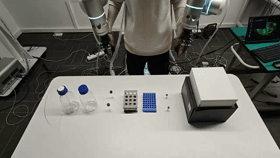 
<a href="media/robot_demo_step1.mp4">Source video (MP4)</a>

</td><td valign="top">

Seat vials into the corresponding racks. Two difficulty levels apply (see below).

| Action | Description |
|--------|-------------|
| 1a | Seat a 2 mL vial into the 2 mL rack |
| 1b | Seat a 2 mL vial into the 2 mL rack |
| 1c | Seat an 8 mL vial into the 8 mL rack |
| 1d | Seat an 8 mL vial into the 8 mL rack |

**Difficulty Levels** (team chooses before each round; affects Step 1 score multiplier):

| Level | Rack State | Target Position | Score Multiplier |
|-------|-----------|-----------------|:----------------:|
| **Easy** | Rack is **empty** | A corner of the team's choice | ×1.0 |
| **Hard** | Rack is **partially filled** (only 4 empty slots remain) | Random empty slots (randomized each round) | ×1.5 |

**Start state:** Vials placed at random positions on the table within the robot's reachable workspace. Racks placed at designated positions.

**End state:** All 4 vials fully inserted, upright, in correct positions. No damage or drops.

</td></tr>
</table>

### Step 2: Instrument Interfacing

<table>
<tr><td width="280" valign="top">

 
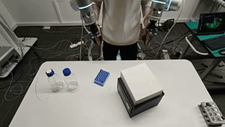 
<a href="media/robot_demo_step2.mp4">Source video (MP4)</a>

</td><td valign="top">

Load a sample rack into an analytical instrument by operating its 3D-printed drawer mechanism.

| Action | Description |
|--------|-------------|
| 2a | Open the instrument drawer |
| 2b | Place the rack in the correct position |
| 2c | Close the instrument drawer |

**Start state:** Instrument drawer closed. Rack placed at a random position on the table within the robot's reachable workspace.

**End state:** Rack seated in the correct position inside the drawer. Drawer fully closed without excessive force.

</td></tr>
</table>

### Step 3: Mobile Phase Management

<table>
<tr><td width="280" valign="top">

 
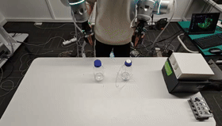 
<a href="media/robot_demo_step3.mp4">Source video (MP4)</a>

</td><td valign="top">

Switch the solvent supply line from bottle A to bottle B by operating threaded caps and relocating the flexible tubing.

| Action | Description |
|--------|-------------|
| 3a | Remove the cap from the source bottle |
| 3b | Remove the tubing from the source bottle |
| 3c | Insert the tubing into the target bottle |
| 3d | Replace the cap on the source bottle |

**Start state:** Tubing inserted in source bottle (cap on target bottle). Both bottles placed at random positions on the table within the robot's reachable workspace.

**End state:** Tubing relocated to target bottle. Cap re-secured on source bottle. Both bottles upright, no spills.

</td></tr>
</table>

## Bill of Materials

| | Item | Qty | Unit Price (CNY) | Supplier link |
|:---:|------|:---:|---:|------|
| 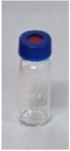 | 2 mL Sample Vial | Per setup | 0.4 | [Taobao](https://item.taobao.com/item.htm?id=17615677498) |
| 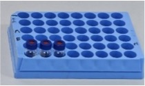 | 2 mL Sample Vial Rack | 1 | 120 | [Taobao](https://item.taobao.com/item.htm?id=710110090808) |
| 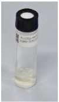 | 8 mL Glass Vial | Per setup | 1.5 | [Taobao](https://item.taobao.com/item.htm?id=19991893535) |
| 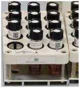 | 8 mL Glass Vial Rack | 1 | self-printed | In-house stock |
| 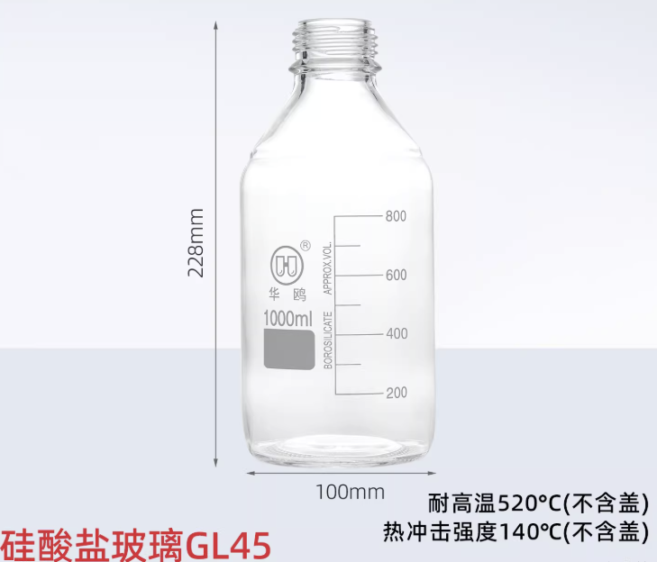 | 500mL Solvent Bottle | 2 | 13.12 | [Tmall](https://detail.tmall.com/item.htm?app=chrome&bxsign=scdYgqU44PMI89owadFI75sB1AKZoK-56RJ-S0sGQMMQCRSMt85P7s_MWn1Zi2EDgmwTDBX0cNlR53ioUYeZTSzemEHAf_KfzD0UP6RO9DM0KASlpvjyj9DhgdZygutLxYs&cpp=1&id=869789079507&price=13.12&shareUniqueId=35385001152&share_crt_v=1&shareurl=true&short_name=h.iUwsuCzZsSsNdJS&skuId=5701565429699&sourceType=item%2Citem&sp_tk=Y1JxY1VDVm9NZnQ%3D&spm=a2159r.13376460.0.0&suid=e57d488b-6d6f-4727-b3e2-5cdbf43f0b1a&tbSocialPopKey=shareItem&tk=cRqcUCVoMft&un=89f5c99caa22df09defba349c3f14615&un_site=0&ut_sk=1.aW3bAFvpTXYDAIgzFZZTpDpb_21646297_1773634888738.Copy.1&wxsign=tbwYdZcFKjVktSwOIbAfreMg-q47_HrpJ1qddFoIl80b9bFAj8OwWKDz70JBQTxcrfj-pVLJdn1IgXb8SOiEbgdg7jMyGGiHDKkmCU838rghPgcLYXEuDKL6kqNZU3FbWFD) |
| 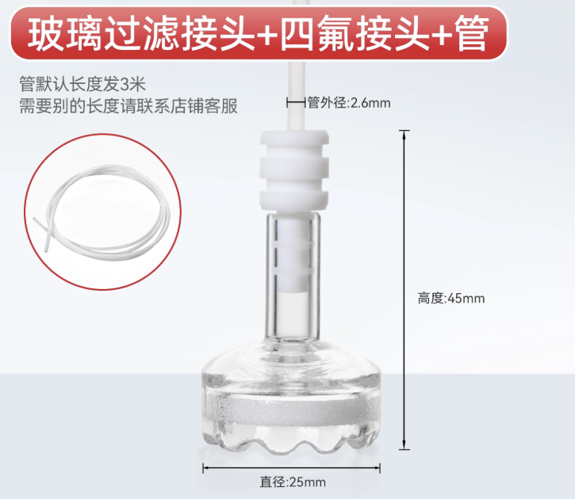 | Flexible Tubing + Filter Head | 1 set | 100 | [Tmall](https://detail.tmall.com/item.htm?id=956086151290&skuId=6049729811075) |
| 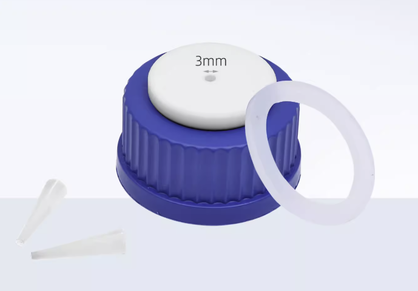 | Spare Bottle Cap | 2 | 8 | [Tmall](https://detail.tmall.com/item.htm?id=869789079507&skuId=5762711841749) |
| 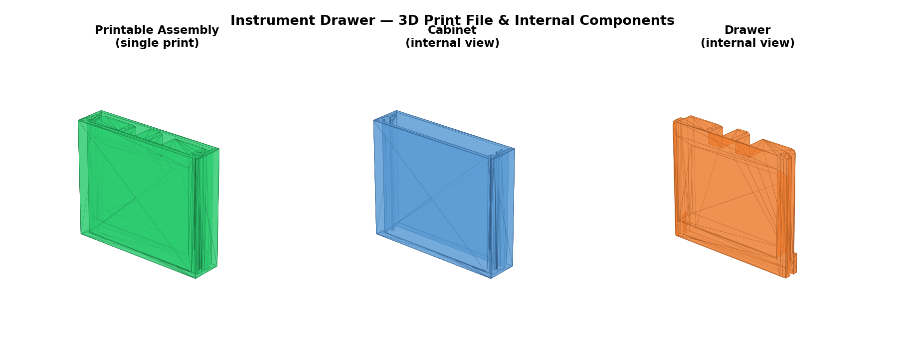 | Instrument Drawer Assembly | 1 | self-printed | [`drawer.stl`](parts/drawer.stl) |

### 3D-Printed Parts

Printable STL and source CAD files are in [`parts/`](parts/). Click any file on GitHub to open the interactive 3D viewer.

| File | Part | Used In |
|------|------|---------|
| [`2ml-sample-vial.stl`](parts/2ml-sample-vial.stl) | 2 mL Sample Vial | Step 1 |
| [`2ml-sample-vial-rack.stl`](parts/2ml-sample-vial-rack.stl) | 2 mL Sample Vial Rack | Step 1, 2 |
| [`8ml-glass-vial.stl`](parts/8ml-glass-vial.stl) | 8 mL Glass Vial | Step 1 |
| [`8ml-glass-vial-rack-refine.stl`](parts/8ml-glass-vial-rack-refine.stl) | 8 mL Glass Vial Rack | Step 1, 2 |
| [`drawer.stl`](parts/storage_drawer_new.stl) | Instrument Drawer Assembly | Step 2 |
| [`1l-solvent-bottle.stl`](parts/1l-solvent-bottle.stl) | 1 L Solvent Bottle | Step 3 |

> **Instrument Drawer** — `drawer.stl` prints as a single piece (print-in-place, no assembly required). The reference files [`instrument-cabinet.stl`](parts/instrument-cabinet.stl) and [`instrument-drawer.stl`](parts/instrument-drawer.stl) show the cabinet and drawer components separately for reference.
>
> 

## Robot Demonstration

Reference animations of the robot performing the task (human-teleoperated), showing the full workflow. **Source video (MP4)** under each clip opens the original recording on GitHub (full quality and frame rate). All files also live in [`media/`](media/).

<table>
<tr>
<td width="280" valign="top" align="center">

<strong>Step 1: Sample Loading</strong>  
 
<a href="media/robot_demo_step1.mp4">Source video (MP4)</a>

</td>
<td width="280" valign="top" align="center">

<strong>Step 2: Instrument Interfacing</strong>  
 
<a href="media/robot_demo_step2.mp4">Source video (MP4)</a>

</td>
<td width="280" valign="top" align="center">

<strong>Step 3: Mobile Phase Management</strong>  
 
<a href="media/robot_demo_step3.mp4">Source video (MP4)</a>

</td>
</tr>
</table>

## Scoring

### Competition Rules

- **Time limit:** 20 minutes per team.
- **Rounds:** Each round = Step 1 → Step 2 → Step 3, performed in order.
- **Objective:** Maximize total score by completing as many rounds as possible.
- **Difficulty choice:** Teams select Easy or Hard for Step 1 **before each round**. The choice applies a score multiplier to Step 1 only.
- **Randomization:** Object initial positions are randomized each round but always within the robot's reachable workspace. For Step 1 Hard mode, the occupied/empty slots in the rack are also randomized.
- **Autonomy multiplier:** Each **round** is one **run** for autonomy. Sum the base points from Steps 1–3 in that round, then multiply by that round’s [autonomy level multiplier](../README.md#autonomy-level-multiplier) (×1 on-site teleop / ×2 remote teleop / ×4 fully autonomous). Teams declare one autonomy level per round; the same level applies to all steps in that round.

### Point Breakdown

Steps 2 and 3 are worth **20 points each per round**. Step 1 base score is **20 points**, multiplied by the difficulty factor (×1.0 Easy, ×1.5 Hard → **20 or 30 pts**).

#### Step 1 — Sample Loading (20 pts base × difficulty)

| Action | Base Points | Start → End | Criteria |
|--------|:------:|-------------|----------|
| 1a – Seat 2 mL vial | 5 | Vial on table → seated in 2 mL rack | Vial fully inserted, upright, correct position |
| 1b – Seat 2 mL vial | 5 | Vial on table → seated in 2 mL rack | Same |
| 1c – Seat 8 mL vial | 5 | Vial on table → seated in 8 mL rack | Vial fully inserted, upright, correct position |
| 1d – Seat 8 mL vial | 5 | Vial on table → seated in 8 mL rack | Same |

> **Easy mode:** 20 × 1.0 = **20 pts** max &nbsp;|&nbsp; **Hard mode:** 20 × 1.5 = **30 pts** max

#### Step 2 — Instrument Interfacing (20 pts)

| Action | Points | Start → End | Criteria |
|--------|:------:|-------------|----------|
| 2a – Open drawer | 5 | Drawer closed → drawer fully extended | Drawer fully extended without excessive force |
| 2b – Place rack | 10 | Rack on table → rack seated in drawer | Rack in correct position and orientation |
| 2c – Close drawer | 5 | Drawer open with rack → drawer fully closed | Drawer fully closed flush with cabinet |

#### Step 3 — Mobile Phase Management (20 pts)

| Action | Points | Start → End | Criteria |
|--------|:------:|-------------|----------|
| 3a – Remove cap | 5 | Cap on target bottle → cap removed | Cap unscrewed without stripping or spilling |
| 3b – Remove tubing | 5 | Tubing in source bottle → tubing removed | Tubing cleanly removed from source bottle |
| 3c – Insert tubing | 5 | Tubing in hand → tubing in target bottle | Tubing inserted into target bottle |
| 3d – Replace cap | 5 | Cap removed → cap on source bottle | Cap re-secured on source bottle |

#### Penalties

| Violation | Penalty |
|-----------|---------|
| Dropped vial | 0 pts for that action (no partial credit) |
| Spilled liquid | 0 pts for that action |
| Damaged equipment (stripped cap, broken vial) | 0 pts for that action |
| Skipped step | Remaining steps in that round score 0 |

### Example

> A team completes 3 full rounds and is mid-way through round 4 when time expires. They choose **one autonomy level per round** (applied to the sum of Step 1–3 base points for that round):
>
> | Round | Difficulty | Base (Steps 1+2+3) | Autonomy | Subtotal |
> |:-----:|:----------:|:-------------------:|:--------:|:--------:|
> | 1 | Easy | 20 + 20 + 20 = 60 | Remote ×2 | 120 |
> | 2 | Hard | 30 + 20 + 20 = 70 | On-site teleop ×1 | 70 |
> | 3 | Hard | 30 + 15 + 20 = 65 | Fully autonomous ×4 | 260 |
> | 4 | Easy | 20 + 10 + 0 = 30 (time expires mid–Step 3) | Remote ×2 | 60 |
> | | | | **Total** | **510** |

## Coming Soon

- **Datasets** — UMI and/or real robot teleoperation datasets for this task
- **Simulation Environment** — digital-twin simulator for this task
