# Track 4: Deformable Manipulation

## Overview

This task evaluates robotic manipulation of deformable objects in manufacturing scenarios. The robot must pick a T-shirt from a stack and load it onto a printing pallet, demonstrating sophisticated perception and control capabilities for handling flexible materials.

## Task Rules

The competition time limit is **15 minutes**. The goal is to pick and load a T-shirt onto a printing pallet with proper alignment and surface quality.

**Operational Constraints (Setup & Reset):**
- **Human intervention:** Any human intervention (except teleoperation) to the setup during robot movement is penalized, and that round receives zero points. The timer does not stop.
- **Reset Time:** Time spent resetting the workspace (e.g., restacking T-shirts) is excluded from the 15-minute limit.
- **Timer policy:** Once the timer starts, manual changes to the setup are not allowed. Any maintenance or repair work does not pause the timer.
- **Evaluation handoff:** Teams must inform the judges when alignment is finished. The timer stops for evaluation at that point, and robots are not allowed to move during the evaluation period.
- **Custom grippers:** Teams may install their own grippers in any design.
- **Team-defined setup:** T-shirt stack position and robot arm base positions are decided by each team.
- **Stack size:** Each stack contains 5 T-shirts.
- **Pallet constraints:** Modifications to the pallet are not allowed. Teams are only allowed to use helper parts/tools that are not attached to the pallet.
- **T-shirt removal:** T-shirt removal after a run is performed by the team, and the timer is stopped during removal.

### Step 1: Picking

<table>
<tr><td width="280" valign="top">

</td><td valign="top">

Grasp a single T-shirt from a stack. The robot must identify and separate one T-shirt from the pile.

| Action | Description |
|--------|-------------|
| 1a | Identify the topmost T-shirt on the stack |
| 1b | Grasp and separate a single T-shirt |

**Success Criteria:** Exactly one T-shirt securely grasped without disturbing the rest of the stack.

</td></tr>
</table>

### Step 2: Loading

<table>
<tr><td width="280" valign="top">

</td><td valign="top">

Position and load the T-shirt onto the printing pallet.

| Action | Description |
|--------|-------------|
| 2a | Transport T-shirt to the printing pallet |
| 2b | Place T-shirt onto the pallet surface |

**Success Criteria:** T-shirt placed on the pallet, covering the effective area appropriately.

</td></tr>
</table>

### Step 3: Alignment & Surface Quality

<table>
<tr><td width="280" valign="top">

</td><td valign="top">

Align the T-shirt with pallet edges and ensure a flat surface without wrinkles.

| Action | Description |
|--------|-------------|
| 3a | Align T-shirt edges with pallet boundaries |
| 3b | Smooth the surface to remove wrinkles |

**Success Criteria:** T-shirt is aligned and smooth in the target region.

**Alignment definition:** Alignment is counted when the T-shirt collar region is within the defined target region.

**Surface smoothness definition:** Surface quality is evaluated by the number of wrinkles on the target printing area.

  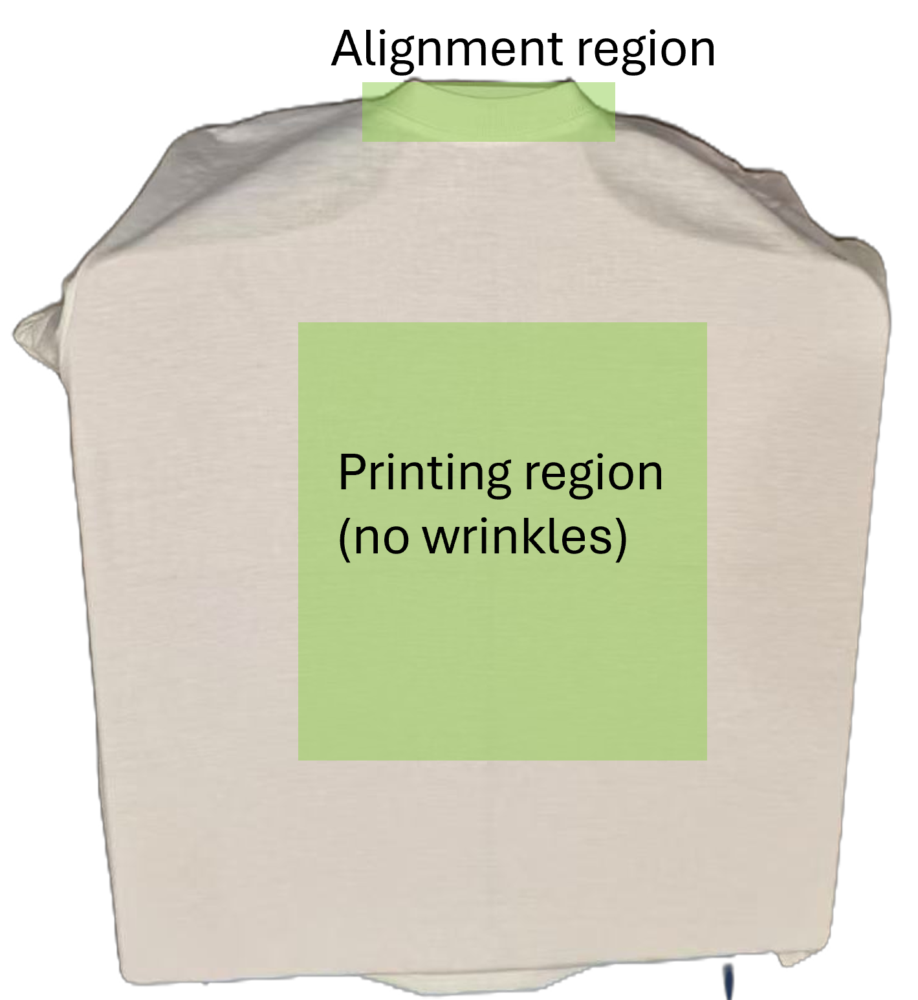

## Good vs Bad Examples

Reference examples for alignment and smoothness in the target region.

### Good Examples

<table>
<tr>
<td width="280" valign="top" align="center">
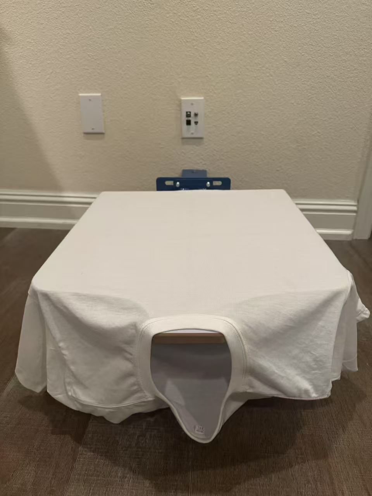 
Good Example 1
</td>
<td width="280" valign="top" align="center">
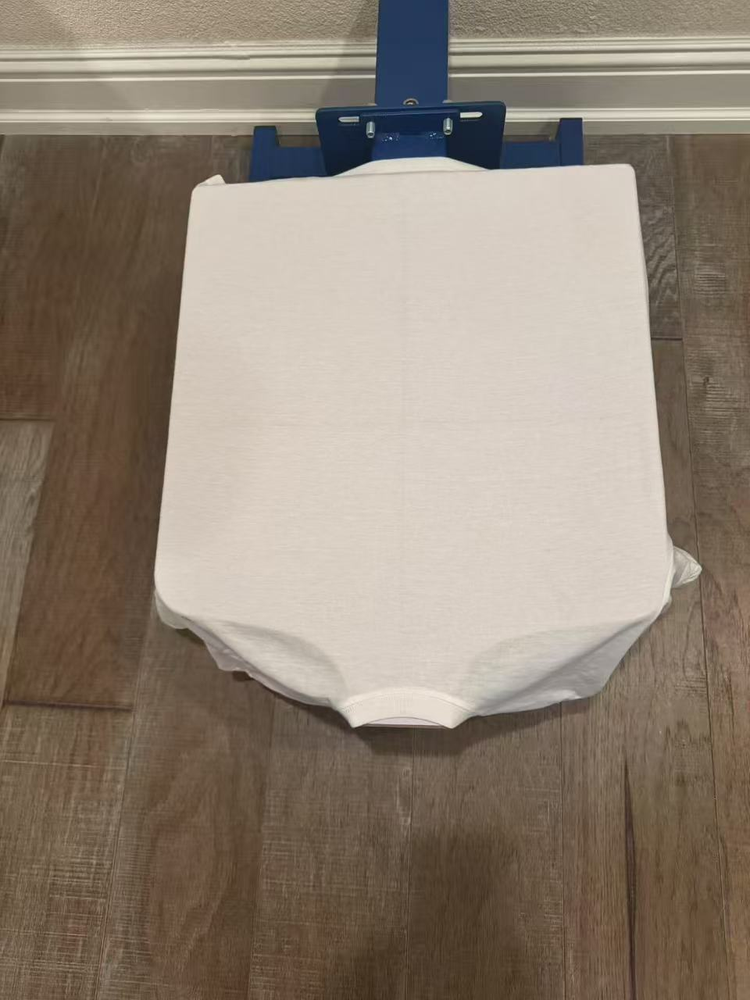 
Good Example 2
</td>
</tr>
</table>

### Marginally Acceptable Example

<table>
<tr>
<td width="280" valign="top" align="center">
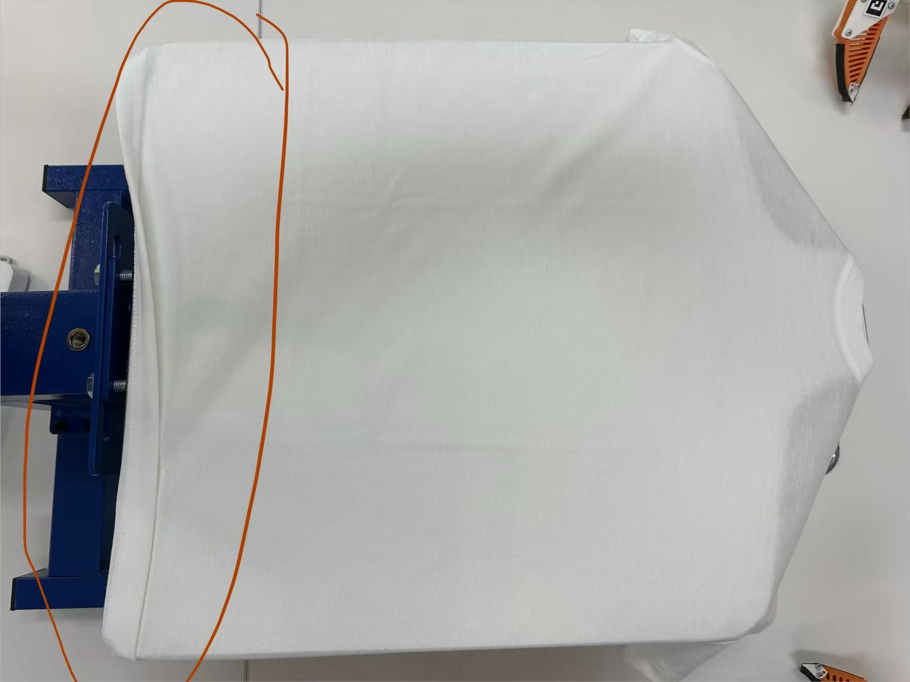 
Aligned, Not Smooth
</td>
</tr>
</table>

### Bad Examples

<table>
<tr>
<td width="280" valign="top" align="center">
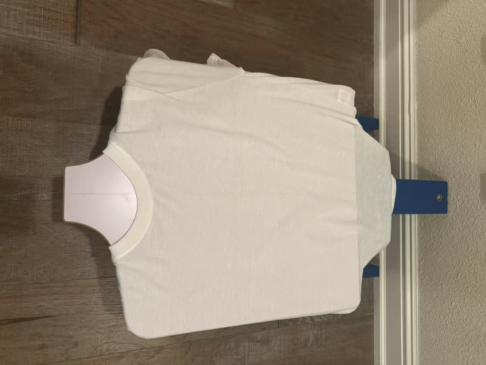 
Not Aligned (Case 1)
</td>
<td width="280" valign="top" align="center">
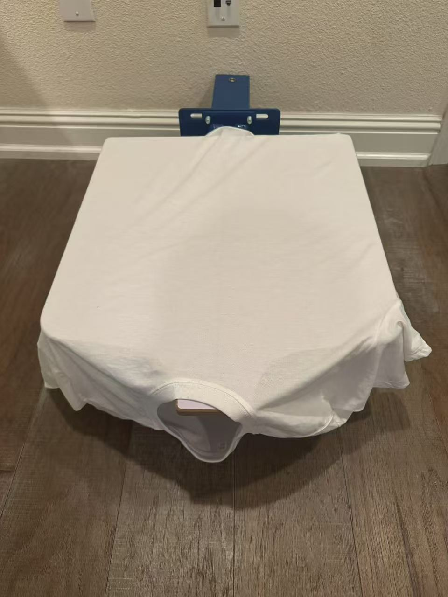 
Not Aligned (Case 2)
</td>
</tr>
<tr>
<td width="280" valign="top" align="center">
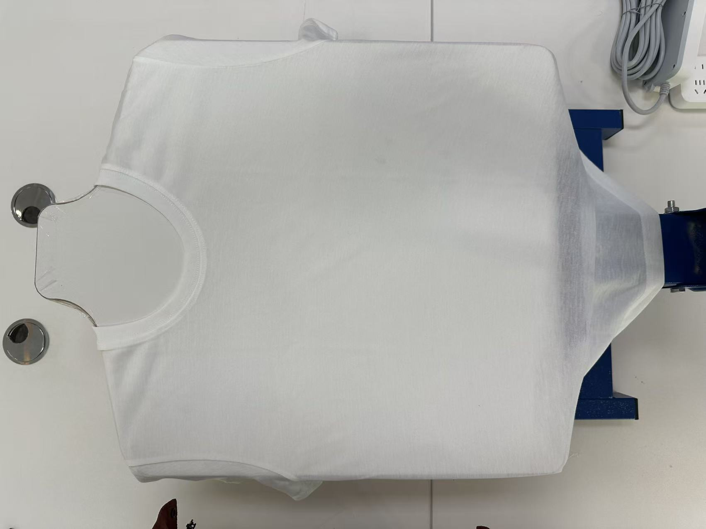 
Not Aligned (Case 3)
</td>
<td width="280" valign="top" align="center">
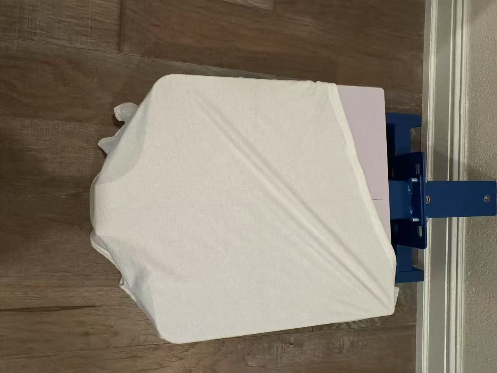 
Not Aligned, Not Smooth (Case 1)
</td>
</tr>
<tr>
<td width="280" valign="top" align="center">
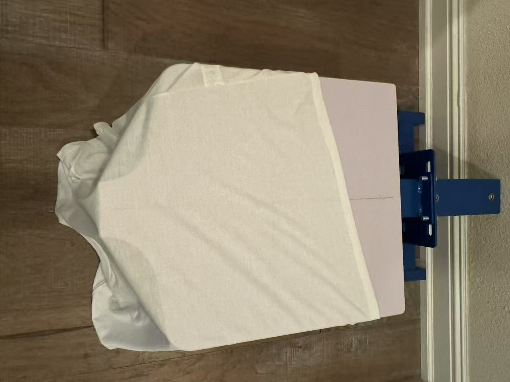 
Not Aligned, Not Smooth (Case 2)
</td>
</tr>
</table>

</td></tr>
</table>

## Human demonstration

Reference videos of a human performing the task (complementing the robot clips above).

<table>
<tr>
<td width="280" valign="top" align="center">

<strong>Human demo 1</strong>  

</td>
<td width="280" valign="top" align="center">

<strong>Human demo 2</strong>  

</td>
</tr>
</table>

## Bill of Materials

| Image | Item | Qty | Price (CNY) | Supplier link |
|---|---|---:|---|---|
| 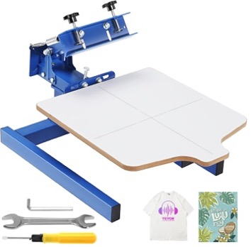 | Printing Pallet (55×45cm, effective area: 54×45cm) | 1 | 378 | [Taobao](https://e.tb.cn/h.7w2Qa3LXhcVOGZw?tk=GTA9UmIukJ3) / [Amazon](https://www.amazon.com/VEVOR-Printing-Color-Station-Press/dp/B0BXP1HJ6C/?_encoding=UTF8&pd_rd_w=Mjx1V&content-id=amzn1.sym.4efc43db-939e-4a80-abaf-50c6a6b8c631%3Aamzn1.symc.5a16118f-86f0-44cd-8e3e-6c5f82df43d0&pf_rd_p=4efc43db-939e-4a80-abaf-50c6a6b8c631&pf_rd_r=NAP40A9PB0VT83TT2RVD&pd_rd_wg=AssFP&pd_rd_r=0fbae0b4-d773-4eba-a48e-dddd5057f63f&ref_=pd_hp_d_atf_ci_mcx_mr_ca_hp_atf_d&th=1) |
| 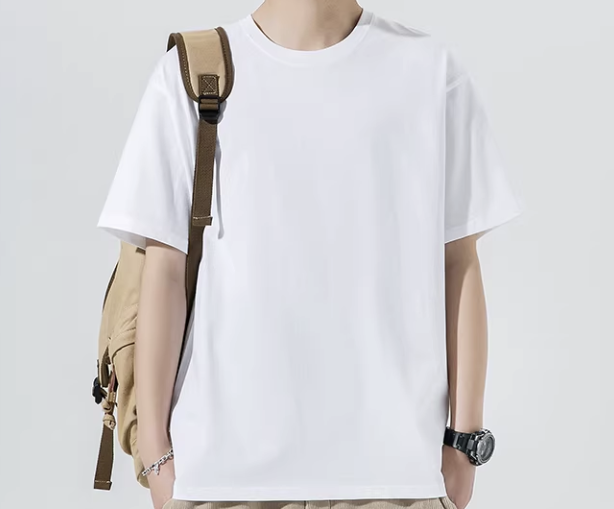 | White T-shirt (2XL, 185g, 100% cotton, ~70cm length, ~50cm chest width) | 1 | 8.9 | [Taobao](https://e.tb.cn/h.7D4U7zMW2ydxlRn?tk=66wBUNF8Tsf) |

## Scoring

### Competition Rules

- **Time limit:** 15 minutes per team.
- **Objective:** Pick, load, and align a T-shirt on the printing pallet.
- **Intervention:** Any human intervention (except teleoperation) to the setup during robot movement is penalized, and that round receives zero points. The timer does not stop.
- **Autonomy multiplier:** Each **run** (one complete T-shirt cycle through Steps 1–3) uses one [autonomy level multiplier](../README.md#autonomy-level-multiplier) (×1 on-site teleop / ×2 remote teleop / ×4 fully autonomous). Sum base points for that T-shirt, then multiply by the level declared for that run.

### Point Breakdown

| Action | Points | Criteria |
|--------|:------:|----------|
| Pick + Load | +5 | Successfully picks a single T-shirt and loads it onto the pallet |
| Alignment | +2.5 | T-shirt is aligned in the target region |
| Smooth Surface | +2.5 | T-shirt surface is smooth in the target region. This score applies only if alignment is achieved. |
| Multiple T-shirts picked | -5 | More than one T-shirt is placed onto the pallet in a single attempt. Incidental contact with another T-shirt does not by itself trigger this penalty. |
| Dislocated T-shirts left unpicked | -0.5 each | If remaining T-shirts are dislocated and the team gives up recovering/picking them, deduct 0.5 points per T-shirt. For automation, manual recovering/picking is not allowed. |
| Human manual intervention (Steps 1-3) | -5 | Any human manual intervention during Steps 1 to 3 incurs a -5 penalty. |

### Example

> A robot completes two rounds of T-shirt loading (base points, before applying per-run autonomy):
>
> | Round | Action | Result | Score |
> |:-----:|--------|--------|:-----:|
> | 1 | Pick + Load | Success | +5 |
> | 1 | Alignment | Aligned in target region | +2.5 |
> | 1 | Smooth Surface | Smooth in target region | +2.5 |
> | 2 | Pick + Load | Success | +5 |
> | 2 | Alignment | Aligned in target region | +2.5 |
> | 2 | Smooth Surface | Not smooth in target region | +0 |
> | | | **Total (base)** | **+17.5** |

## Coming Soon

- **Datasets** — UMI and/or real robot teleoperation datasets for this task
- **Simulation Environment** — digital-twin simulator for this task
